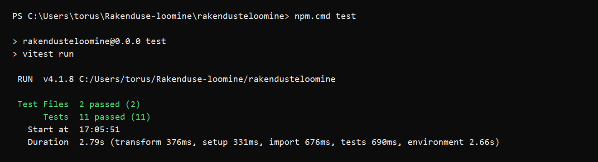

# Testimisplaan - Movie Catalog Application

## GitHubi repositoorium

https://github.com/Roven555/Rakenduse-loomine

## Projekti kirjeldus

Projekt on Reacti ja Vite'iga loodud filmikataloogi rakendus. Kasutaja saab sirvida filme, otsida filme pealkirja järgi, filtreerida filme kategooria, meeleolu ja kestuse põhjal, sorteerida tulemusi ning märkida filme meeldivaks, ebameeldivaks või hiljem vaatamiseks.

## Testimise eesmärk

Testimise eesmärk on kontrollida rakenduse kõige olulisemaid kasutajategevusi ja andmetöötluse loogikat. Testid aitavad veenduda, et otsing, filtreerimine, sorteerimine ja filmikaardi tegevused töötavad ootuspäraselt ka siis, kui koodi hiljem muudetakse.

## Testitavad funktsionaalsused

| Testi nr | Funktsionaalsus | Miks testida | Oodatav tulemus |
| --- | --- | --- | --- |
| 1 | Filmide otsing pealkirja järgi | Otsing on rakenduse peamine viis kindla filmi leidmiseks | `filterMovies` tagastab ainult filmid, mille pealkiri vastab otsingule |
| 2 | Filmide filtreerimine kategooria järgi | Kasutaja peab saama vaadata ainult valitud žanri filme | `filterMovies` tagastab ainult valitud kategooriasse kuuluvad filmid |
| 3 | Filmide filtreerimine kestuse järgi | Kestuse filter aitab valida filmi kasutaja vaba aja põhjal | Pikkade filmide valik tagastab ainult vähemalt 150-minutilised filmid |
| 4 | Filmide sorteerimine hinde järgi | Sorteerimine peab näitama parima hindega filme õiges järjekorras | `sortMovies` järjestab filmid kõrgeimast hindest madalaimani |
| 5 | Kategooriate nimekirja loomine | Filtrinupud sõltuvad filmide andmetest ja ei tohi dubleerida kategooriaid | `getCategories` tagastab unikaalsed kategooriad ning esimene valik on `Kõik` |
| 6 | Otsingukomponendi sisestus ja tühjendamine | Otsinguvälja muutmine peab andma rakendusele uue päringu ning tühjendus peab päringu eemaldama | `SearchBar` kutsub `onSearchChange` õigete väärtustega ja hoiab fookuse sisendväljal |
| 7 | Sorteerimise rippmenüü | Kasutaja valitud sorteerimisviis peab jõudma rakenduse olekusse | `SortSelect` kutsub `onSortChange` valitud väärtusega |
| 8 | Kategooria filtri nupp | Filtrinupp peab käivitama kategooria muutmise | `FilterPills` kutsub `onCategoryChange` valitud kategooriaga |
| 9 | Tühja filmilisti vaade | Kasutajale peab olema selge, kui tulemusi ei leitud | `MovieList` kuvab tühja oleku teate |
| 10 | Filmikaardi kuvamine ja avamine | Filmikaart peab kuvama filmi andmed ning viima detailvaatesse | `MovieCard` kuvab pealkirja, aasta, kategooriad ja kutsub kaardi klõpsul `onCardClick` |
| 11 | Filmikaardi tegevusnupud | Meeldimise nupp ei tohi samal ajal avada detailvaadet | `MovieCard` kutsub `toggleLike` ja peatab kaardi klõpsusündmuse leviku |

## Testimisraamistik

Kasutatud tööriistad:

- **Vitest** - ühiktestide käivitamiseks Vite projektis
- **React Testing Library** - React komponentide renderdamise ja kasutajategevuste testimiseks
- **@testing-library/user-event** - realistlike klaviatuuri ja hiire tegevuste simuleerimiseks
- **jsdom** - brauserilaadse DOM keskkonna loomiseks testides

Testide käivitamise käsk:

```bash
npm test
```

## Testimise sammud

1. Ava terminalis projekti kaust `rakendusteloomine`.
2. Paigalda sõltuvused käsuga `npm install`, kui neid pole veel paigaldatud.
3. Käivita testid käsuga `npm test`.
4. Kontrolli, et terminalis oleks tulemus `Test Files 2 passed (2)` ja `Tests 11 passed (11)`.
5. Lisa terminali õnnestunud tulemuse kuvatõmmis testimisplaani juurde.

## Testimise tulemus

Testid käivitati käsuga `npm test`. Kõik testid õnnestusid:



## Esitluse struktuur

1. Sissejuhatus - projekti nimi ja eesmärk.
2. Projekti kirjeldus - mida filmikataloogi rakendus teeb.
3. Testimisplaan - tabel testitavate funktsionaalsustega.
4. Koodinäide - näide `filterMovies` funktsioonist ja vastavast ühiktestist.
5. Testi tulemus - terminali kuvatõmmis õnnestunud Vitest tulemusest.
6. Õppetunnid - õppisin seadistama Vitesti React/Vite projektis ja testima nii loogikat kui ka komponente.
7. Kokkuvõte - testimine on oluline, sest see aitab leida vead enne, kui kasutaja nendega kokku puutub.
